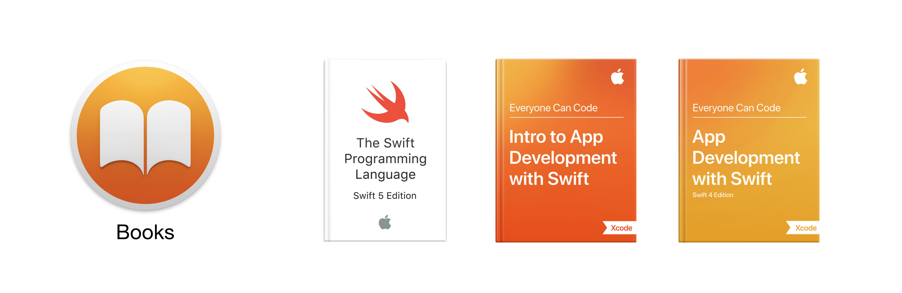
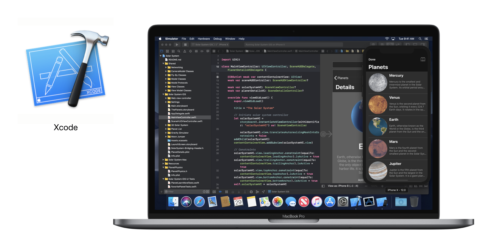

# Introduction to Swift

## Swift  

ภาษา Swift ได้ถูกแนะนำให้นักพัฒนาทั่วโลกได้รู้จักในงาน WWDC 2014 เพื่อใช้เป็นภาษายุคใหม่ที่มีความกระชับคล้ายกับ Ruby และ JavaScript สามารถทำงานได้รวดเร็ว และง่ายต่อการพัฒนาแอพพลิเคชั่นสำหรับอุปกรณ์ของแอปเปิล โดยสิ่งที่คุณต้องจัดเตรียมเพื่อการเรียนรู้วิธีการเขียนคำสั่งด้วยภาษา Swift และการสร้าง iOS Appliction ประกอบด้วย

* เครื่องคอมพิวเตอร์ส่วนบุคคล เช่น Macbook, iMac หรือ Mac mini ซึ่งทำงานบนระบบปฏิบัติการ macOS รุ่นล่าสุด
* บัญชีผู้ใช้งาน Apple ID ซึ่งสามารถสมัครได้ที่ [https://appleid.apple.com/](https://appleid.apple.com/) 
* โปรแกรม Xcode รุ่นล่าสุด ดาวน์โหลดได้จาก [App Store](https://itunes.apple.com/th/app/xcode/id497799835?mt=12) หรือ [https://developer.apple.com/xcode/](https://developer.apple.com/xcode/)
* เครื่อง iPad, iPhone, AppleTV หรือ Apple Watch \(หากต้องการทดสอบการทำงานบนอุปกรณ์จริง\)

สำหรับแหล่งข้อมูลเพื่อใช้อ้างอิงหรือประกอบการเรียนรู้วิธีการเขียนคำสั่งด้วยภาษา Swift และการพัฒนา iOS Application อย่างเป็นทางการของ Apple ประกอบด้วย

* [The Swift Programming Language \(Swift 5.0\)](https://books.apple.com/th/book/the-swift-programming-language-swift-5-0/id881256329), Apple Inc., 2018
* [Intro to App Development with Swift](https://books.apple.com/th/book/intro-to-app-development-with-swift/id1118575552), Apple Inc., 2017.
* [App Development with Swift](https://itunes.apple.com/WebObjects/MZStore.woa/wa/viewBook?id=1219117996), Apple Inc., 2017.
* [Getting Started with Swift](https://developer.apple.com/videos/play/wwdc2016/404/), in WWDC 2016 - Session 404, Apple Inc., 2016.
* [Swift.org](https://swift.org), เว็บไซต์เพื่อการแลกเปลี่ยนเรียนรู้เกี่ยวกับภาษา Swift

## Xcode

**Xcode** คือ เครื่องมือบนระบบปฏิบัติการ macOS ที่ใช้เพื่อการสร้างและพัฒนาแอพพลิเคชั่นสำหรับ macOS, iOS, WatchOS และ tvOS โดย Xcode มาพร้อมกับเครื่องมือทุกอย่างที่จำเป็นต้องใช้เพื่อสร้างสรรค์แอพที่แสนมหัศจรรย์ อาทิ หน้าจอสำหรับการเขียนคำสั่ง, หน้าจอสำหรับการออกแบบส่วนติดต่อกับผู้ใช้ และส่วนสำหรับจำลองการทำงาน \(Simulator\) ของอุปกรณ์ต่างๆ 

**Playground** คือ ตัวช่วยสำหรับการเรียนรู้ภาษา Swift ที่ดีที่สุด เนื่องจากมีระบบโต้ตอบอัตโนมัติที่จะทำให้เวลาที่เราเขียนคำสั่งในภาษา Swift แล้วจะสามารถแสดงผลลัพธ์ให้เราเห็นได้ทันที


**รายละเอียดเพื่อการอ้างอิง  
ผู้เขียน** ธิติ ธีระเธียร    
**วันที่เผยแพร่**  วันที่ 13 เมษายน 2562.  
**เข้าถึงได้จาก** [https://ajthiti.gitbook.io/swift/](https://ajthiti.gitbook.io/swift/)  
**เงื่อนใขในการใช้งาน**  
This work is licensed under a [Creative Commons Attribution-NonCommercial-NoDerivatives 4.0 International License](http://creativecommons.org/licenses/by-nc-nd/4.0/).


