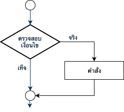
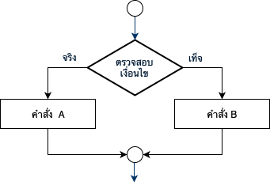
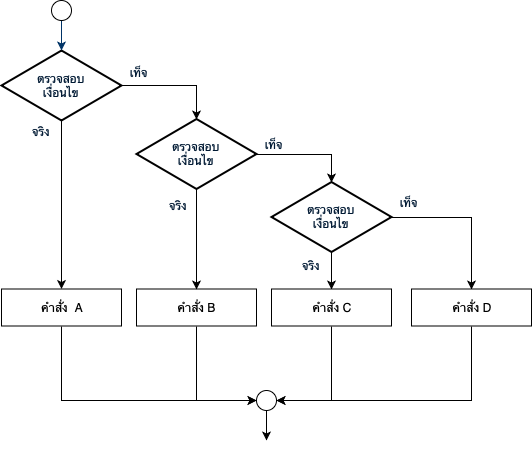
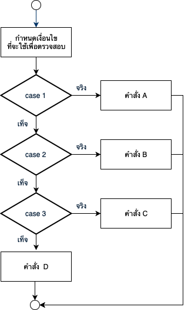

# Conditional Statement

### การใช้คำสั่ง If

คำสั่ง `if` เป็นการกำหนดให้โปรแกรมทำงานตามคำสั่งที่อยู่ใน Scope ของ {...} เมื่อตรวจสอบเงื่อนไขแล้ว พบว่า ผลลัพธ์ของการทำงานมีค่าเป็น "จริง \(true\)"



ตัวอย่างในการใช้คำสั่ง `If`

```swift
var temperatureInFahrenheit = 30

if temperatureInFahrenheit <= 32 {
    print("It's very cold. Consider wearing a scarf.")
}
```

### การใช้คำสั่ง If...else

คำสั่ง `if...else` เป็นการกำหนดให้โปรแกรมทำงานตามคำสั่งที่อยู่ใน Scope ก่อน else เมื่อตรวจสอบเงื่อนไขแล้ว พบว่า ผลลัพธ์ของการทำงานมีค่าเป็น "จริง \(true\)" และจะทำตาม Scope ซึ่งอยู่หลัง else เมื่อตรวจสอบเงือนไขแล้ว พบว่า ผลลัพธ์ของการทำงานมีค่าเป็น "เท็จ \(false\)" 



ตัวอย่างในการใช้คำสั่ง `If...else`

```swift
temperatureInFahrenheit = 40

if temperatureInFahrenheit <= 32 {
    print("It's very cold. Consider wearing a scarf.")
} else {
    print("It's not that cold. Wear a t-shirt.")
}
```

ในกรณีที่ต้องการให้มีทางเลือกในการทำงานมากกว่า 2 ทางเลือก เราจะสามารถใช้คำสั่ง `else if` เพื่อกำหนดเงื่อนไขที่ต้องตรวจสอบเป็นลำดับชั้น โดยโปรแกรมจะประมวลผลคำสั่งซึ่งอยู่ภายใน scope ของเงื่อนไขที่เป็น จริง \(true\) เพียงทางเลือกเดียวเท่านั้น แต่หากตรวจพบว่าไม่มีเงื่อนไขใดเลยที่เป็นจริง โปรแกรมจะทำคำสั่งสุดท้าย



ตัวอย่างในการใช้คำสั่ง `else if`

```swift
var studentScore = 73

if studentScore >= 80 {
    print("ผลการเรียน คือ A")
 } else if studentScore >= 70 {
    print("ผลการเรียน คือ B")
 } else if studentScore >= 60 {
    print("ผลการเรียน คือ C")
 } else if studentScore >= 50 {
    print("ผลการเรียน คือ D")
 } else {
    print("ผลการเรียน คือ F")
 }
```

```swift
let hourOfDay = 12
var timeOfDay = ""

if hourOfDay < 6 {
    timeOfDay = "Early morning"
} else if hourOfDay < 12 {
    timeOfDay = "Morning"
} else if hourOfDay < 17 {
    timeOfDay = "Afternoon"
} else if hourOfDay < 20 {
    timeOfDay = "Evening"
} else if hourOfDay < 24 {
    timeOfDay = "Late evening"
} else {
    timeOfDay = "INVALID HOUR!"
}

print(timeOfDay)
```

### การใช้คำสั่ง switch

คำสั่ง `switch` ใช้สำหรับการเลือกทำแบบหลายทางเลือกซึ่งพิจารณาจากการตรวจสอบค่าในตัวแปร โดยแบ่งทางเลือกต่าง ๆ ออกเป็น case ซึ่งแต่ละ case จะต้องมีค่าไม่ซ้ำกัน และหากผลการตรวจสอบค่าของตัวแปรนั้นไม่ตรงกับ case ใดเลย จะทำคำสั่งใน default



ตัวอย่างในการใช้ `switch`

```swift
var gradeLevel = "Grade 1"
var projectName = "To be determined"

switch gradeLevel {
case "Grade 1":
    projectName = "My lovely pet"
case "Grade 2":
    projectName = "Science in daily life"
case "Grade 3":
    projectName = "The folk wisdom"
case "Grade 4", "Grade 5", "Grade 6":
    projectName = "Student's choice"
default:
    projectName = "N/A"
}
```

ตัวอย่างการกำหนดทางเลือกที่ต้องการตรวจสอบเป็นช่วงของข้อมูล

```swift
let approximateCount = 62
let countedThings = "moons orbiting Saturn"
let naturalCount: String

switch approximateCount {
case 0:
    naturalCount = "no"
case 1...5:
    naturalCount = "a few"
case 6...12:
    naturalCount = "several"
case 13..<100:
    naturalCount = "dozens of"
case 100..<1000:
    naturalCount = "hundreds of"
default:
    naturalCount = "many"
}

print("There are \(naturalCount) \(countedThings).")

// Prints "There are dozens of moons orbiting Saturn.
```

## แหล่งข้อมูลอ้างอิง

* [The Swift Programming Language \(Swift 5.0\)](https://books.apple.com/th/book/the-swift-programming-language-swift-5-0/id881256329), Apple Inc., 2018. Available on: Apple Book Store.
* [App Development with Swift](https://books.apple.com/th/book/app-development-with-swift/id1465002990), Apple Inc., 2017. Available on: Apple Book Store.



**รายละเอียดเพื่อการอ้างอิง  
ผู้เขียน** ธิติ ธีระเธียร    
**วันที่เผยแพร่**  วันที่ 6 พฤษภาคม 2562.  
**เข้าถึงได้จาก** [https://ajthiti.gitbook.io/swift/conditional-statement](https://ajthiti.gitbook.io/swift/conditional-statement)  
**เงื่อนใขในการใช้งาน**  
This work is licensed under a [Creative Commons Attribution-NonCommercial-NoDerivatives 4.0 International License](http://creativecommons.org/licenses/by-nc-nd/4.0/).


