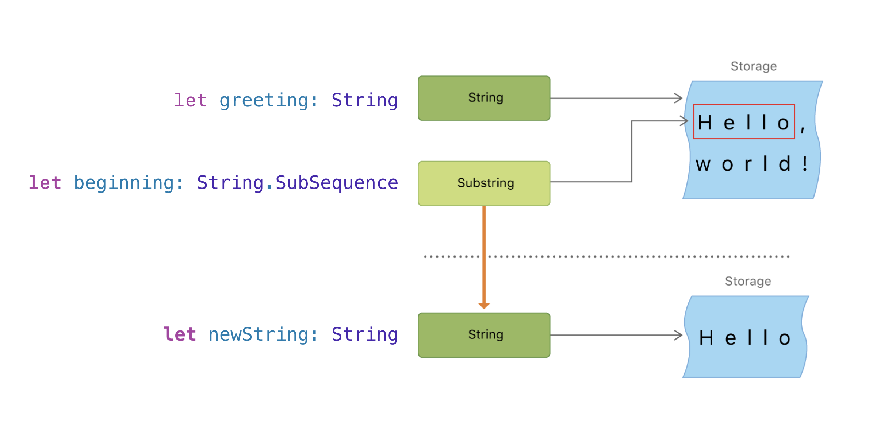

# String

### การสร้างและจัดเก็บข้อความ

การประกาศค่าเพื่อจัดเก็บข้อมูลประเภทข้อความ หรือ String สามารถทำได้ทั้งแบบ `let` และ `var` ดังนี้

```swift
let companyName = "บจ.ศิลานักปราชญ์"
var companyCEO = "คุณธิติ ธีระเธียร"
```

การสร้างข้อความใหม่จาก String ตั้งแต่ 2 ค่าขึ้นไป ทำได้โดยใช้เครื่องหมาย `+` \(Additional operator\) เพื่อเชื่อมต่อ \(Concatenation\) ข้อความ ดังนี้

```swift
var message = "Hello" + " " + "my name is "
let name = "Thiti"
message += name      // "Hello my name is Thiti"
```

หากต้องการแสดงอักขระ เช่น ' \(Single quote\) , " \(Double quote\) , \\(Backslash\) หรือ กำหนดให้แสดงการเว้นวรรคด้วย Tab ในข้อความ จะสามารถทำได้โดยใช้ escape charector ดังนี้

* `\'`  หมายถึง การแสดงเครื่องหมาย  Single quote
* `\"`  หมายถึง การแสดงเครื่องหมาย Double quote
* `\\` หมายถึง การแสดงเครื่องหมาย  Backslash
* `\t`  หมายถึง การเว้นวรรคด้วย tab
* `\n` หมายถึง การขึ้นบรรทัดใหม่

ตัวอย่างเช่น

```swift
let greeting = "การแสดงข้อความว่า \"Hello, world!\""
print(greeting) // การแสดงข้อความว่า "Hello, world!"
```

ในบางครั้ง เราอาจจะต้องการนำค่าที่เก็บไว้ในตัวแปรหรือค่าคงที่มาแทรกลงในข้อความ \(Interpolation\) ซึ่งสามารถทำได้โดยใช้  `\(`ชื่อตัวแปรหรือค่าคงที่`)` ตัวอย่างเช่น

```swift
let firstName = "Looknam"
let city = "Nonthaburi"
let welcomeString = "Hello \(firstName), welcome to \(city)!"
print(welcomeString) // Hello Looknam, welcome to Nonthaburi!

let multiplier = 3
let message = "\(multiplier) times 2.5 is \(Double(multiplier) * 2.5)"
// message is "3 times 2.5 is 7.5"
```

### ตัวอักขระ \(Character Type\)

Character Type จะใช้ในการจัดเก็บ "ตัวอักขระ" เพียงตัวเดียว เช่น "ก", "A" , " は" หรือ "!" เป็นต้น 

```swift
let exclamationMark: Character = "!"
let sayHi: String = "Hello"

var message = sayHi + String(exclamationMark)
```

```swift
let someCharacter: Character = "e"
switch someCharacter {
  case "a", "e", "i", "o", "u":
      print("\(someCharacter) is a vowel.")
  default:
      print("\(someCharacter) is not a vowel.")
}
// e is a vowel.
```

### การเปรียบเทียบข้อความ

ข้อความในภาษา Swift ลักษณะเป็นแบบ case-sensitive กล่าวคือ หากทำการเปรียบเทียบค่าของ "January" และ "january" จะได้ผลลัพธ์ว่าเป็นข้อความที่มีค่าไม่เท่ากัน เราสามารถนำข้อความมาเปรียบเทียบกันได้โดยใช้ **ตัวดำเนินการเปรียบเทียบ \(Comparison Operators\)** ดังอย่างต่อไปนี้

```swift
let month = "January"
let otherMonth = "January"
let lowercaseMonth = "january"

if month == otherMonth {
  print("They are the same!")
}

if month != lowercaseMonth {
  print("They are not the same!")
}
```

ดังนั้น หากต้องการทำการเปรียบเทียบข้อมูลโดยในรูปแบบ case-insensitive จะต้องใช้ตัวดำเนินการเปรียบเทียบร่วมกับฟังก์ชัน `uppercased()`, `lowercased()` หรือ `capitalized` ดังตัวอย่างต่อไปนี้

```swift
var usa = "United states of america"
print(usa.uppercased())  // UNITED STATES OF AMERICA
print(usa.lowercased())  // united states of america
print(usa.capitalized)   // United States of America

let month = "January"
let lowercaseMonth = "january"

if month.lowercased() == lowercaseMonth.lowercased() {
    print("They are the same word!")
} else {
    print("They are not the same word!")
}
```

### ฟังก์ชันและคุณสมบัติพื้นฐานอื่นๆ

`isEmpty` เป็น Boolean property ที่ใช้เพื่อตรวจสอบว่ามีข้อความถูกเก็บอยู่ใน String หรือไม่

```swift
var myString = ""
if myString.isEmpty {
  print("The string is empty")
}
```

`count` เป็น property ที่ใช้เพื่อการนับจำนวนตัวอักขระ \(Character\) ใน String 

```swift
let myName = "Thiti Theerathean"
myName.count  // 17

let myNickname = "Kunk"
myNickname.count  // 4
```

`append()` และ `appending()` เป็นฟังก์ชันสำหรับการเพิ่มข้อความต่อท้ายข้อความเดิมที่เก็บไว้ใน String

```swift
// append ใช้เพิ่มข้อความต่อท้ายข้อความเดิม โดยเก็บค่าลงในตัวแปรตัวเดิม
var myMessage = "Hello"
myMessage.append("World!!")   // HelloWorld!!

// appending ใช้เพิ่มข้อความต่อท้ายข้อความเดิม โดยเก็บค่าลงในตัวแปรตัวใหม่
myMessage = "Good"
let newMessage = myMassage.appending("Bye!") // GoodBye!
```

`hasPrefix()` และ `hasSuffix ()` เป็นฟังก์ชันเพื่อใช้ในการตรวจสอบอักขระหรือคำขึ้นต้นและลงท้ายในข้อความ ตามลำดับ

```swift
let greetingMessage = "Hello, world!"

print(greeting.hasPrefix("Hello"))  //true
print(greeting.hasSuffix("world!"))  //true
print(greeting.hasSuffix("World!"))  //false
```

`contain ()` เป็นฟังก์ชันสำหรับตรวจสอบว่ามี String ที่ระบุอยู่ในข้อความหรือไม่

```swift
let greetingMessage = "Hi, my name is Thiti Theerathean"
if greetingMessage.contains("my name is") {
 print("Making an introduction")
}
```

`replacingOccurrences (Of: with: )` เป็นฟังก์ชันสำหรับการแทนที่คำหรือข้อความใน String

```swift
var mainMessage = "Obj-C เป็นภาษาที่ง่ายต่อการเรียนรู้ เราใช้ภาษา Obj-C ในการพัฒนาแอพสำหรับ iPhone"
print(mainMessage)  //"Obj-C เป็นภาษาที่ง่ายต่อการเรียนรู้ เราใช้ภาษา Obj-C ในการพัฒนาแอพสำหรับ iPhone"

var resultString = mainMessage.replacingOccurrences(of: "Obj-C", with: "Swift")
print(resultString)  //"Swift เป็นภาษาที่ง่ายต่อการเรียนรู้ เราใช้ภาษา Swift ในการพัฒนาแอพสำหรับ iPhone"
```

`firstIndex(of: )` เป็นฟังก์ชันที่ใช้ในการค้นหาตำแหน่งของอักขระที่ระบุ โดยผลลัพธ์ที่ได้จะเป็น String.index ของตำแหน่งแรกที่พบอักขระ และเป็นข้อมูลแบบ Optional เนื่องจากจะคืนค่าเป็น nil หากค้นหาแล้วไม่พบอักขระที่ต้องการอยู่ในข้อความ ดังนั้น จึงต้องทำการ Unwrap หรือ Binding ก่อนเมื่อนำมาใช้งาน

```swift
let myString = "ABCDEFG"
let positionOf_C = myString.firstIndex(of: "C")
if positionOf_C != nil {
    print("ตรวจพบอักขระดังกล่าวในข้อความ")
}
```

`range(of: )` เป็นฟังก์ชันที่ทำงานในลักษณะเดียวกับ `firstIndex(of: )` แต่ใช้ในการค้นหาชุดของอักขระที่ได้ระบุไว้ ผลลัพธ์ที่ได้จากการทำงานเป็นแบบ Optional กล่าวคือจะคืนค่าเป็น nil หากค้นหาแล้วไม่พบชุดอักขระในข้อความ ดังนั้น จึงต้องทำการ Unwrap หรือ Binding ก่อนเมื่อนำมาใช้งาน

```swift
let myString = "ABCDEFG"
let rangeOf_CDE = myString.range(of: "CDE")
if rangeOf_CDE != nil {
    print("ตรวจพบชุดของอักขระดังกล่าวในข้อความ")
}
```

`remove(at: )` เป็นฟังก์ชันสำหรับการลบอักขระ 1 ตัว ซึ่งอยู่ ณ ตำแหน่ง String.index ของข้อความที่กำหนด และ `removeSubrange ( )` เป็นฟังก์ชันสำหรับการลบชุดอักขระในตำแหน่งหรือช่วงของ String.index ที่กำหนดออกจากข้อความ

```swift
var myString = "ABCDEFG"
let character_e = myString.firstIndex(of: "E")
myString.remove(at: character_e!)
print(myString)  // ABCDFG

myString = "ABCDEFG"
let startCharacter = myString.firstIndex(of: "C")
let endCharacter = myString.firstIndex(of: "E")
myString.removeSubrange(startCharacter!...endCharacter!)
print(myString)  // ABFG

myString = "ABCDEFG"
let subString = myString.range(of: "CDE")
myString.removeSubrange(subString!)
print(myString)  // ABFG

```

`insert( _: , at: )` เป็นฟังก์ชันสำหรับการเพิ่มอักขระ 1 ตัว ณ ตำแหน่ง String.index ของข้อความที่กำหนด และ `insert (contentOf: , at: )` เป็นการแทรกชุดอักขระในตำแหน่งString.index ของข้อความที่กำหนด

```swift
var myUsername = "ajthiti"

let strIndex = myUsername.endIndex
myUsername.insert("@", at: strIndex)
print(myUsername) // ajthiti@

myUsername.insert(contentsOf: "silanukprach.com", at: myUsername.endIndex)
print(myUsername) // ajthiti@silanukprach.com
```

`replaceSubrange ( _: , with: )`  ใช้สำหรับการแทนที่ข้อความด้วยชุดอักขระในตำแหน่งของช่วงที่กำหนด

```swift
var myString = "การใช้คำสั่งในภาษา Obj-C เพื่อแทนที่ข้อความ"
let findString = myString.range(of: "Obj-C")
myString.replaceSubrange(findString!, with: "Swift")
print(myString)  // การใช้คำสั่งในภาษา Swift เพื่อแทนที่ข้อความ
```

### สตริงย่อย \(Substring\)

เมื่อเราดำเนินการแบ่งข้อความ \(String\) ออกมาบางส่วน ผลลัพธ์ที่ได้ คือ ข้อมูลที่มีโครงสร้างเป็น String.SubSequence โดย SubSequence เป็น typealis ของ Substring ซึ่งการดำเนินการกับ Substring นั้น จะมีความสะดวกและมีประสิทธิภาพกว่าการสร้าง String ขึ้นใหม่ เนื่องจากสตริงย่อยใช้ที่เก็บข้อมูลร่วมกับ String เดิม และยังมี Method ส่วนใหญ่เช่นเดียวกับ String ดังนั้น คุนจึงสามารถทำงานกับ Substring ได้ในลักษณะเดียวกับ String  

```swift
let greeting = "Hello, world!"
let index = greeting.firstIndex(of: ",") ?? greeting.endIndex
let beginning: String.SubSequence = greeting[..<index]
// beginning is "Hello"


// Convert the result to a String for long-term storage.
let newString = String(beginning)
```



ในตัวอย่างข้างต้น `greeting` เป็น String ซึ่งหมายความว่า มันมีพื้นที่หน่วยความจำที่เก็บอักขระที่ประกอบขึ้นเป็นข้อความ เนื่องจาก `beginning` เป็น Substring ของ  `greeting` ดังนั้นจะเกิดความผิดพลาดขึ้นหากเขียนคำสั่ง

```swift
let greeting = "Hello, world!"
let index = greeting.firstIndex(of: ",") ?? greeting.endIndex
let beginning: String = greeting[..<index]  //error
```

การใช้ Substring นั้น เหมาะสมกับการดำเนินการในช่วงสั้นๆ เท่านั้น  เนื่องจากมันมีการใช้หน่วยความจำในการจัดเก็บข้อมูลจาก String ต้นฉบับ จึงทำให้ระบบจำเป็นต้อง retain หน่วยความจำของต้นฉบับเอาไว้ตราบเท่าที่ Substring นั้นยังทำงานอยู่ ส่งผลให้เกิดความสิ้นเปลืองหน่วยความจำของระบบ ดังนั้น เมื่อต้องการจัดเก็บหรือนำข้อมูลไปใช้งานในระยะยาวจึงควรทำการแปลงชนิดให้เป็น String เสียก่อน 

```swift
// Convert the result to a String for long-term storage.
let newString = String(beginning)
```

## แหล่งข้อมูลอ้างอิง

* [The Swift Programming Language \(Swift 5.0\)](https://books.apple.com/th/book/the-swift-programming-language-swift-5-0/id881256329), Apple Inc., 2018. Available on: Apple Book Store.
* [App Development with Swift](https://books.apple.com/th/book/app-development-with-swift/id1465002990), Apple Inc., 2017. Available on: Apple Book Store.


**รายละเอียดเพื่อการอ้างอิง  
ผู้เขียน** ธิติ ธีระเธียร    
**วันที่เผยแพร่**  วันที่ 16 มิถุนายน 2562.  
**วันที่ปรุงปรุงล่าสุด** วันที่ 1 กุมภาพันธ์ 2563  
**เข้าถึงได้จาก** [https://ajthiti.gitbook.io/swift/string](https://ajthiti.gitbook.io/swift/string)  
**เงื่อนใขในการใช้งาน**  
This work is licensed under a [Creative Commons Attribution-NonCommercial-NoDerivatives 4.0 International License](http://creativecommons.org/licenses/by-nc-nd/4.0/).


